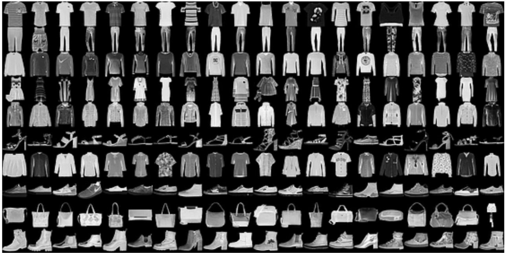

  
   <h1 align="center">Fashion MINST Image Classification</h1>

Aim :mag_right:
----------------
The aim of this study is to implement and evaluate the performance of supervised machine learning classifiers to classify greyscale images into a set of given categories. The accuracy and running time of the classifiers with 10-fold cross-validation were compared using Python’s scikit-learn library. The dataset used consists of greyscale images of size 28x28. There are 30,000 training samples and 2,000 labelled testing samples.

Data and Schema
------------
The data used is called the Fashion-MNIST dataset which contains Zalando's article images. It is stored in the input folder with training and testing splits.

